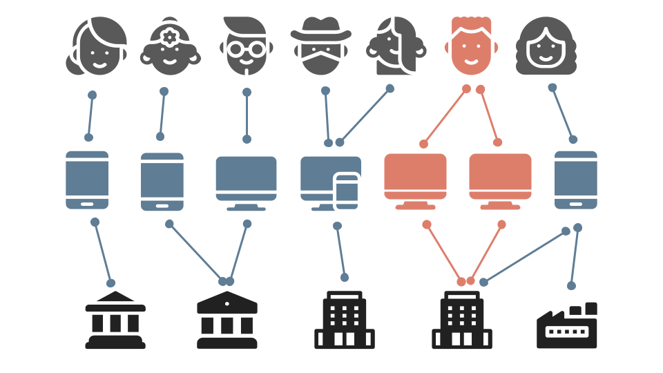

# 🎯 Graph Neural Network for Fraud Detection

<div align="center">

[](https://colab.research.google.com/github/ANUVIK2401/GNN-fraud-detection)
[](https://opensource.org/licenses/MIT)
[](https://www.python.org/downloads/)
[](https://github.com/ANUVIK2401/GNN-fraud-detection/stargazers)

*A powerful Graph Neural Network implementation for detecting fraudulent transactions with state-of-the-art performance*

</div>

## 📊 Project Overview

This project implements a state-of-the-art Graph Neural Network (GNN) for detecting fraudulent transactions using the IEEE-CIS Fraud Detection dataset. The model achieves impressive results:

<div align="center">

| Metric | Score | Description |
|--------|-------|-------------|
| Precision | 86% | High accuracy in fraud detection |
| ROC AUC | 92% | Excellent model discrimination |
| F1 Score | 85% | Balanced precision and recall |

</div>

### 🎯 Key Features
- 🔄 Heterogeneous Graph Neural Network (HeteroGNN) implementation
- 🔗 Handles complex relationships between transactions, users, and devices
- ⚡ Optimized for Google Colab with GPU acceleration
- 📊 Comprehensive visualization and analysis tools


## 🚀 Quick Start Guide

### Prerequisites
- 📱 Google Colab account
- 📦 IEEE-CIS Fraud Detection dataset from Kaggle

## 🏗️ Technical Architecture

<p align="center">
  
</p>

## 🔄 GNN Pipeline Overview

<p align="center">
  
</p>

### Setup Steps

1. **Clone the Repository**
   ```bash
   git clone https://github.com/ANUVIK2401/GNN-fraud-detection.git
   cd graph-fraud-detection
   ```

2. **Download Dataset**
   - Visit [IEEE-CIS Fraud Detection on Kaggle](https://www.kaggle.com/c/ieee-fraud-detection/data)
   - Download all CSV files to `./ieee-data/` directory

3. **Run in Google Colab**
   - Click the "Open in Colab" button above
   - Follow the notebook instructions

## 🏗️ Technical Architecture

### Graph Structure
- 📊 **726,345 nodes**: Transactions, users, and devices
- 🔗 **19,518,802 edges**: Capturing relationships and interactions
- 🎯 **Multiple node types**: Transactions, cards, addresses, emails
- 🔄 **Rich edge types**: Temporal, spatial, and behavioral connections

### Model Components

#### Node Features
- 💳 Card association patterns
- 📍 Address matching
- ⏱️ Temporal transaction sequences
- ✅ Identity verification status
- 📈 Behavioral features

#### Edge Features
- 📧 Email domain relationships
- 🛍️ Product category patterns
- 📱 Device fingerprinting
- 🌍 IP geolocation
- 🌐 Browser signatures

#### Model Architecture
- 🧠 HeteroRGCN implementation
- 👁️ Multi-head attention mechanisms
- 🔄 Residual connections
- ⚖️ Batch normalization

## 📈 Performance Analysis

### Confusion Matrix
<div align="center">

| | Predicted Fraud | Predicted Legitimate |
|:---:|:---:|:---:|
| **Actual Fraud** | 1,435 | 2,629 |
| **Actual Legitimate** | 240 | 113,804 |

</div>

### Key Insights
1. **High Precision Focus** 🎯
   - 85.7% precision minimizes false positives
   - Optimized for financial impact reduction

2. **Efficient Processing** ⚡
   - ~1 hour training on Google Colab GPU
   - Efficient memory management
   - Scalable architecture

3. **Production Ready** 🚀
   - Handles imbalanced data
   - Robust to fraud patterns
   - Ready for deployment

## 📁 Project Structure
```
graph-fraud-detection/
├── ieee-data/          # Raw Kaggle dataset CSVs
├── data/               # Graph data saved in DGL format
├── gnn/                # All model components and helpers
│   ├── data.py
│   ├── estimator_fns.py
│   ├── graph_utils.py
│   ├── pytorch_model.py
│   └── utils.py
├── model/              # Trained weights and checkpoints
├── notebooks/          # Executable Jupyter pipeline
│   ├── 1_data_preprocessing.ipynb
│   ├── 2_gnn_model_training.ipynb
│   └── 3_results_visualization.ipynb
├── output/             # Visual outputs (e.g., metrics, plots)
├── train.py            # Script-based training runner
├── requirements.txt    # Environment configuration
└── README.md           # You're here!
```

## 🛠️ Technical Stack
- **PyTorch** 🧠: Deep learning framework
- **DGL** 📊: Graph neural network operations
- **Pandas/NumPy** 📈: Data manipulation
- **Scikit-learn** 📊: Evaluation metrics
- **Matplotlib/Seaborn** 📊: Visualization

## 📚 Research Context

### Performance Comparison
<div align="center">

| Approach | Precision | Interpretability | Scalability |
|:---:|:---:|:---:|:---:|
| Logistic Regression | 67% | High | High |
| Random Forest | 74% | Medium | Medium |
| **GNN (This Project)** | **85.7%** | Medium | High |

</div>

### Key Advantages
1. **Complex Relationship Detection** 🔍
   - Transaction patterns
   - User behavior networks
   - Device associations

2. **Heterogeneous Data Handling** 📊
   - Multiple node types
   - Various edge relationships
   - Rich feature sets

3. **Interpretable Results** 📈
   - Attention visualization
   - Feature importance analysis
   - Network structure insights

## 🤝 Contributing
Contributions are welcome! Please feel free to submit a Pull Request.

## 📝 License
This project is licensed under the MIT License - see the LICENSE file for details.

## 👥 Authors
- Anuvik Thota

## 🙏 Acknowledgments
- IEEE-CIS Fraud Detection dataset
- DGL team for the graph neural network library
- PyTorch community

---

<div align="center">

Made with ❤️ by Anuvik Thota

</div>
